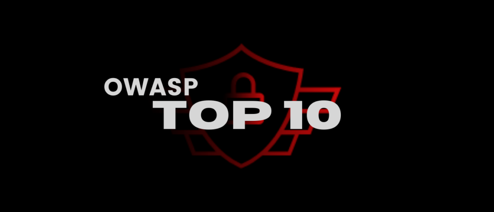

### Topic: OWASP Top 10 - 2021
---

### Broken Access Control (A01:2021)

Imagine a library where anyone can walk in and take out books without checking them out. This vulnerability arises from flaws in access control mechanisms that determine who can access what data or functionalities within an application. Hackers can exploit these weaknesses to view, modify, or delete sensitive information or perform actions they shouldn't be authorized for.

### Cryptographic Failures (A02:2021)

This is like having a weak lock on a treasure chest. It encompasses issues related to encryption, which scrambles data to protect it. Weak encryption algorithms, improper key management (like using the same key for everything), or storing sensitive data unencrypted can all make it easier for attackers to steal information.

### Injection (A03:2021)

This is like injecting a virus into a program. Hackers can inject malicious code into seemingly harmless user inputs like search bars or login forms. The application might process this code without realizing it's harmful, leading to unauthorized access, data theft, or even complete system compromise. Common types of injection attacks include SQL injection.

### Insecure Design (A04:2021)

This new category emphasizes that security should be considered from the very beginning of the development process, not as an afterthought. Applications with inherent design flaws are more vulnerable to attacks  even if the code itself is implemented perfectly.  For instance, a system designed to store all user passwords in plain text (unencrypted) would be inherently insecure by design.

### Security Misconfiguration (A05:2021)

Imagine leaving a house door unlocked even though it has a good deadbolt. This vulnerability arises from improper configuration of servers, databases, or application settings. Default configurations often have unnecessary features enabled or weak settings applied.  Taking the time to harden these configurations by disabling unnecessary features and setting strong security parameters is crucial.

### Vulnerable and Outdated Components (A06:2021)

This is like using a software program with a gaping hole that hackers can exploit.  Using outdated software with known vulnerabilities or failing to update them promptly creates security risks. Developers should keep all components within an application up-to-date with the latest security patches.

### Identification and Authentication Failures (A07:2021)  

This is like using a simple padlock on a bank vault. Weak authentication mechanisms like easily guessable passwords, a lack of multi-factor authentication (MFA), or insecure password storage methods make it easier for attackers to gain unauthorized access to accounts and systems.

### Software and Data Integrity Failures (A08:2021)  

Imagine someone being able to alter someone's grades on a school report card. This vulnerability refers to weaknesses that allow attackers to modify or tamper with data or software code. This could involve unauthorized data modification, code injection attacks, or even manipulating data in transit between systems.

### Security Logging and Monitoring Failures (A09:2021)

Like having a security guard who's always asleep on the job. Security logging involves recording security-related events within an application or system. Security monitoring involves analyzing these logs to detect suspicious activity. Without proper logging or inadequate monitoring, it becomes difficult to detect and respond to attacks in a timely manner.

### Server-Side Request Forgery (SSRF) (A10:2021)  

Imagine a hacker tricking a computer into downloading malware. SSRF is a vulnerability that allows attackers to exploit the server to make unauthorized requests to external resources. This could be used to steal data, compromise internal systems, or even launch denial-of-service attacks.

Bibliography

- A06 Vulnerable and Outdated Components - OWASP Top 10:2021. (n.d.). https://owasp.org/Top10/A06_2021-Vulnerable_and_Outdated_Components/

- OWASP Top Security Risks & Vulnerabilities 2021 Edition. (2024, January 2). Sucuri. https://sucuri.net/guides/owasp_top_10_2021_edition/

- What is the OWASP Top 10 and how does it work? | Synopsys. (n.d.). https://www.synopsys.com/glossary/what-is-owasp-top-10.html