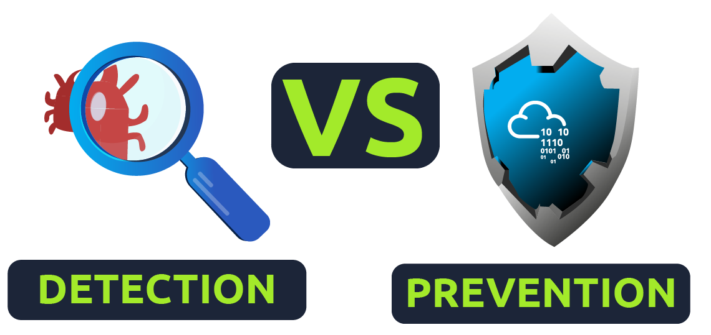

### Topic: Traffic Analysis Essentials
---

Imagine a busy highway with all sorts of vehicles traveling to and from different places. Network security is like the traffic control system for this highway. It makes sure everything runs smoothly and safely. Here's how:

* **Security Guards:**  These are like firewalls and access controls. They check every car (data) trying to enter or leave the highway (network) to make sure they're authorized and not carrying anything dangerous (malware).
* **Traffic Lanes:**  Network segmentation is like dividing the highway into separate lanes for different types of vehicles. This keeps important traffic (like financial data) separated from regular traffic.
* **Secret Tunnels:** Virtual Private Networks (VPNs) are like secure tunnels that allow authorized users to enter a private lane on the highway even if they're physically far away.
* **Security Cameras:**  Intrusion detection systems (IDS) are like cameras constantly monitoring the highway for suspicious activity. If they see something strange, they can alert the security guards.
* **Road Patrols:**  Traffic analysis is like having patrol cars that analyze the flow of traffic. They look for unusual patterns that might indicate an accident (security breach) or a slowdown (denial-of-service attack).

By working together, these security measures keep the network highway safe and efficient for everyone who uses it. 

**Network Security**

###  The Essentials: Authentication and Authorization

Network security revolves around two main ideas:

* **Authentication**:  Verifying a user's identity (like checking your ID at a building entrance). Passwords, fingerprint scanners, and security tokens are common methods.
* **Authorization**:  Granting access based on your role (like having a key for your specific apartment). The network controls what you can access (e.g., managers can access sensitive files, while cleaning staff might only access common areas).

###  Control Levels: Building a Secure Network

Network security operations use a three-layered approach to ensure maximum protection:

| Level | Description | Example |
|---|---|---|
| **Physical** | Prevents unauthorized physical access to network devices and cables. |  Security guards, locked doors, and camera surveillance. |
| **Technical** | Protects network data through encryption and secure protocols. |  Firewalls, data encryption tunnels, and secure access controls. |
| **Administrative** | Ensures consistent security practices through policies and procedures. |  Creating security policies, access control levels, and user training programs. |

###  Approaches and Elements: Tools for Network Security

There are two main approaches to network security, each with various tools and elements:

**1. Access Control:**  Ensures only authorized users and devices can access the network.

* **Firewall Protection:**  Acts as a security guard, monitoring incoming and outgoing traffic, blocking suspicious activity.
* **Network Access Control (NAC):**  Checks devices for compliance before allowing network access.
* **Identity and Access Management (IAM):**  Manages user identities and access permissions to network resources.
* **Load Balancing:**  Distributes network traffic efficiently across multiple resources.
* **Network Segmentation:**  Creates isolated network zones for different user groups and functionalities.
* **Virtual Private Networks (VPN):**  Enables secure remote access by creating encrypted tunnels over the internet.
* **Zero Trust Model:**  Provides access only to the minimum resources required for a user's role.

**2. Threat Control:**  Detects and prevents malicious activity on the network.

* **Intrusion Detection and Prevention (IDS/IPS):**  Monitors network traffic and alerts or blocks suspicious activity.
* **Data Loss Prevention (DLP):**  Scans traffic and prevents sensitive data from being leaked.
* **Endpoint Protection:**  Secures devices connected to the network (laptops, desktops, etc.) using antivirus, antimalware, and other tools.
* **Cloud Security:**  Protects cloud-based systems from threats using measures like VPNs and encryption.
* **Security Information and Event Management (SIEM):**  Analyzes logs and traffic data to identify security incidents.
* **Security Orchestration Automation and Response (SOAR):**  Automates tasks and coordinates security tools to respond to incidents.
* **Network Traffic Analysis & Network Detection and Response:**  Analyzes network traffic to identify threats and anomalies.

###  Network Security Management Operations

Network security management involves ongoing tasks:

| Task | Description |
|---|---|
| Deployment & Configuration | Installing and configuring network devices and software. |
| Monitoring | Continuously monitoring network activity for threats and suspicious behavior. |
| Maintenance | Performing updates, patches, and configuration adjustments. |

###  Managed Security Services (MSS)

Organizations lacking dedicated security staff can outsource these tasks to Managed Security Service Providers (MSSPs). Common MSS services include:

* **Network Penetration Testing:**  Simulating attacks to identify vulnerabilities.
* **Vulnerability Assessment:**  Identifying and analyzing network vulnerabilities.
* **Incident Response:**  Responding to security breaches in a structured way.
* **Behavioral Analysis:**  Creating baselines for user and system behavior to detect anomalies.
 

**Traffic Analysis**

Imagine a highway full of cars. Traffic analysis is like watching and recording all the car activity on that highway. By looking at the big picture (flow analysis) and zooming in on individual cars (packet analysis), we can learn a lot about what's going on:

* **Traffic Flow:** This is like counting the cars and their speed. It helps us see if the highway is running smoothly or if there's a jam somewhere. In networks, this helps identify performance issues and overloaded areas.
* **Suspicious Activity:**  Just like spotting a car driving erratically, traffic analysis can detect strange patterns in network traffic. This might indicate someone trying to hack into the system or steal data.

Here are two main ways to do traffic analysis:

* **Counting Cars (Flow Analysis):** This is like looking at the overall traffic flow. It's quick and easy to do, but it doesn't tell you everything. You can't see if a specific car is causing trouble. In networks, this involves collecting summaries of data without going into deep detail.
* **Inspecting Cars (Packet Analysis):** This is like pulling over every car to check them out. It takes more time and effort, but you can see everything that's going on. In networks, this involves examining every single piece of data to find suspicious activity.

Even though security tools are getting better, attackers are getting smarter too. Traffic analysis is still important because it can reveal hidden clues in network data, even if it's encrypted. It's like finding a strange tire track that leads you to a crime scene, even if you can't see the criminal themself.

So, traffic analysis is a powerful tool for security analysts, like a detective watching the highway to catch bad guys.

### Topic: Snort

Imagine you're a security guard at a big building. Here's how to stop intruders:

* **Intrusion Detection System (IDS):** This is like having an alarm system. It watches everything and rings the bell (sends alerts) if it sees something suspicious. There are two types:
    * **Network IDS (NIDS):** Watches all the traffic coming in and out of the building (network). If it sees a weird package (like someone trying to pick the lock), it raises the alarm.
    * **Host IDS (HIDS):** Watches a specific room (computer) for suspicious activity. If it sees someone trying to hack into a computer, it raises the alarm.

* **Intrusion Prevention System (IPS):** This is like having a guard who can stop intruders. It not only sees suspicious activity but can also take action to prevent it. There are four types:
    * **Network IPS (NIPS):** Works like the NIDS, but instead of just raising the alarm, it can block the suspicious traffic (like shutting the door on someone trying to break in).
    * **Behavior-Based IPS:** This is a smart guard who learns the normal routine (network traffic). If it sees something unusual (like someone sneaking around at night), it stops them. This is good for catching new tricks intruders might use.
        * But there's a catch! This guard needs some training time to learn what's normal (baseline). If there's a break-in during training, the guard might not recognize it.
    * **Wireless IPS (WIPS):** Watches specifically for suspicious activity on the wireless network (like someone hacking into the Wi-Fi).
    * **Host IPS (HIPS):** Works like the HIDS, but instead of just raising the alarm, it can stop the threat (like shutting down a program trying to steal data).

There are three main ways to spot intruders (detection/prevention techniques):

* **Signature-Based:** This is like having a book of fingerprints (known threats). If the guard sees someone with a matching fingerprint, they know it's a bad guy.
* **Behavior-Based:** This is like the behavior-based IPS. The guard learns the usual routine and spots someone acting strange.
* **Policy-Based:** This is like having building rules (security policies). If the guard sees someone breaking a rule (like entering a restricted area), they stop them.

In simpler terms,
* **IDS:** Sees threats and raises the alarm.
* **IPS:** Sees threats and stops them itself.

**IPS/IDS**

Snort can be used for more than just sniffing and logging traffic.  In IDS/IPS mode, it can manage traffic according to user-defined rules. Here's a table summarizing the key points:

| Feature | Description |
|---|---|
| **NIDS/IPS Mode** |  Allows Snort to analyze traffic based on predefined rules and take actions. |
| **Rules** | User-defined instructions that tell Snort what kind of traffic is suspicious. (Covered in later tasks) |

**Alert Modes**

Snort offers different ways to display alerts triggered by rules:

| Parameter | Description (Output) |
|---|---|
| `-A console` | Basic information about the alert on the console screen (fast style). |
| `-A cmg` | Detailed information including headers and payload (in hex and text format) on the console. |
| `-A full` (default) | All possible information about the alert is written to a log file (no console output). |
| `-A fast` | Summary information about the alert (like direction and header) written to a log file (no console output). |
| `-A none` | No alerts are generated, but traffic is still logged in a binary dump format (no console output). |

**Other Modes**

* `-c` | Defines the Snort configuration file.
* `-T` | Tests the configuration file for errors.
* `-N` | Disables logging (other functions like verbosity can still be active).
* `-D` | Runs Snort in background mode (use `ps` to check the process and `kill` to stop it).

**IPS Mode and Dropping Packets**

Snort can be configured as an IPS to actively prevent suspicious traffic. This requires:

* `-q -Q --daq afpacket` | Activates Data Acquisition (DAQ) modules and uses the `afpacket` module for IPS functionality.
* `-i eth0:eth1` | Specifies the network interfaces to monitor (Snort IPS requires at least two).

**Running Snort without a Configuration File**

It's possible to test user-created rules by running Snort with just the rules file (`-c /etc/snort/rules/local.rules`). This is less performant than using a full configuration file. 

**Snort Rule Structure**

Absolutely, here's a breakdown of the Snort rule structure in a table format, along with explanations for easier understanding:

**Snort Rule Structure**

| Section | Description | Example |
|---|---|---|
| **Rule Header** | Defines what action to take, protocol, source/destination IP and ports, and direction of traffic. | `alert tcp any any <> any 80 (msg: "Web Traffic"; sid: 100001; rev:1;)` |
 **Action** | What Snort does when the rule matches (e.g., alert, log, drop). | `alert` in this example creates an alert. |
 **Protocol** | Type of communication (e.g., tcp, udp, icmp). | `tcp` specifies TCP traffic. |
 **Source IP** | Address of the packet sender (can be "any" for any source). | "any" allows traffic from any source IP. |
 **Destination IP** | Address of the packet receiver (can be "any" for any destination). | "any" allows traffic to any destination IP. |
 **Direction** | Traffic flow (e.g., "->" for source to destination, "<->" for bidirectional). | "<>" means traffic in both directions. |
**Ports** | Source and destination ports (can be "any" for any port). | "any" allows traffic on any port for both source and destination. |
**Rule Options (Optional)** | Additional details to refine the rule (placed inside parentheses). | _(msg: "Web Traffic"; sid: 100001; rev:1;)_ |
**msg** | Message displayed when the rule triggers. | "Web Traffic" describes the alert. |
**sid** | Unique identifier for the rule (user-defined SIDs should be > 1,000,000). | 100001 is a custom rule ID. |
**rev** | Revision number for tracking rule changes. | 1 indicates the first version of this rule. |

**Additional Notes**

* Snort is in passive mode by default (monitoring traffic without blocking).
* Inline mode (active mode) can be used for intrusion prevention (IPS) to block suspicious traffic.
* Rule options can be complex and there are three main categories: general, payload, and non-payload.
* This table covers the basics, refer to Snort documentation for advanced options and in-depth explanations.
