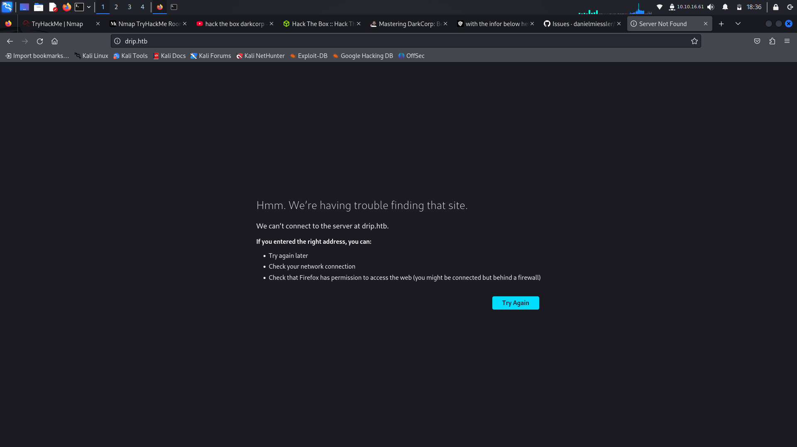
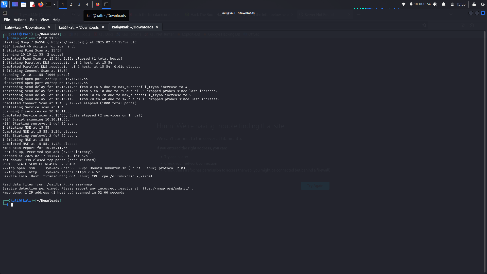
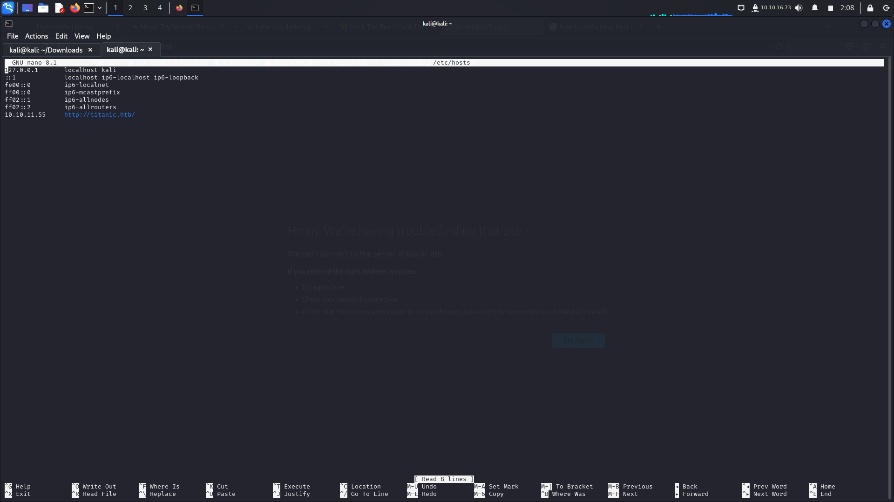
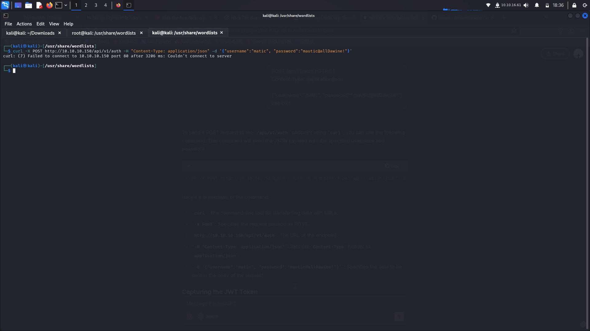

# Topic: HachTheBox Seasonal Challenge


# My Walkthrough: DarkCorp and Titanic Machines on Hack The Box

**Date:** February 24, 2025

## Table of Contents

- [DarkCorp Walkthrough](#darkcorp-walkthrough)
  - [Initial Reconnaissance](#initial-reconnaissance)
    
- [Titanic Walkthrough](#titanic-walkthrough)
  - [Enumeration](#enumeration)
    - [Port Scanning](#port-scanning)
    - [Virtual Host Enumeration](#virtual-host-enumeration)
- References
## DarkCorp Walkthrough

### Initial Reconnaissance

#### Passive Enumeration

I began by gathering information without directly interacting with the target. Utilizing tools and techniques, I collected data about the network, domain names, and potential vulnerabilities.

#### Active Scanning

**Port Scanning with Nmap**

To identify open ports and services running on the target machine, I used Nmap:

```bash
nmap -sV -vv 10.10.11.54
```



### Web Application Exploitation

Even though I knew that a web application was running on the target, I couldn't access the web application because, even though I added the IP address in the localhost, it wouldn't show up.




## Titanic Walkthrough

### Enumeration

**Port Scanning**

I conducted a port scan to identify open services on the target machine:

```bash
nmap -sV -vv 10.10.11.55
```


Open ports:

- **22/tcp**: SSH
- **80/tcp**: HTTP

**Virtual Host Enumeration**

Identifying potential virtual hosts using tools like `gobuster`, I discovered:

```bash
gobuster vhost -u http://<target_ip> -w /usr/share/wordlists/SecLists/Discovery/DNS/subdomains-top1million-5000.txt -o vhost_scan.txt
```

This revealed a virtual host: `dev.titanic.htb`.

### Exploitation

I still faced the same issue as the previous machine, where I couldn't access the web application even after adding the IP address in the localhost.


Despite that I followed a walkthrough and tried the same attack that the person in the walkthrough, however it was not succesful for me.


## References

- [Mastering DarkCorp: Beginner's Guide from Hack The Box](https://thecybersecguru.com/ctf-walkthroughs/mastering-darkcorp-beginners-guide-from-hackthebox/)
- [HTB Titanic Walkthrough](https://medium.com/@ievgenii.miagkov/htb-titanic-adde48f75ff2)
